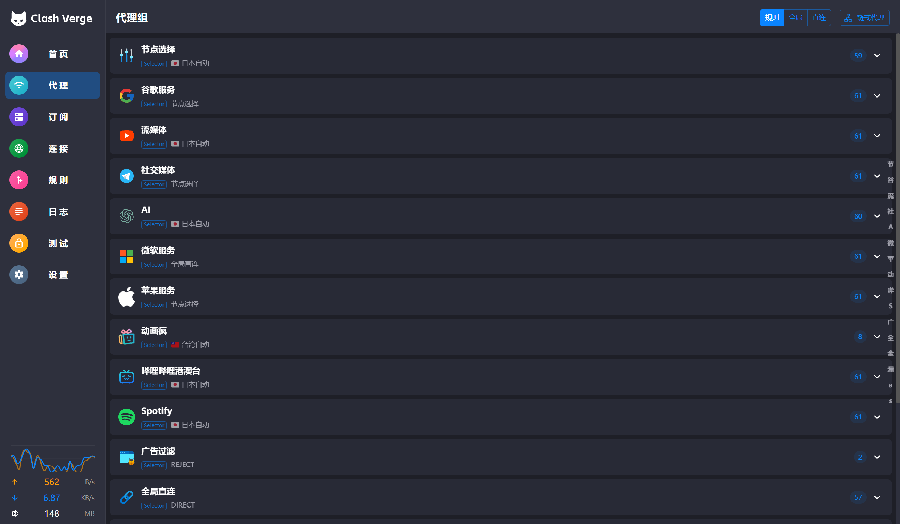
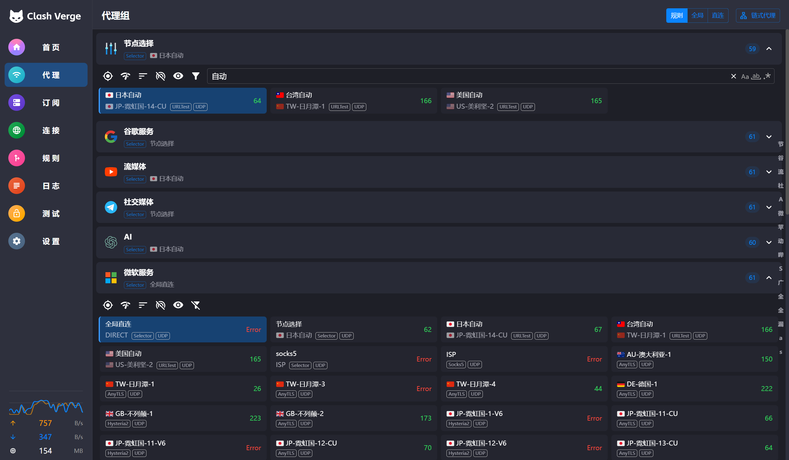
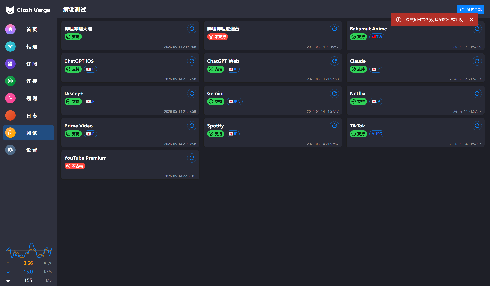
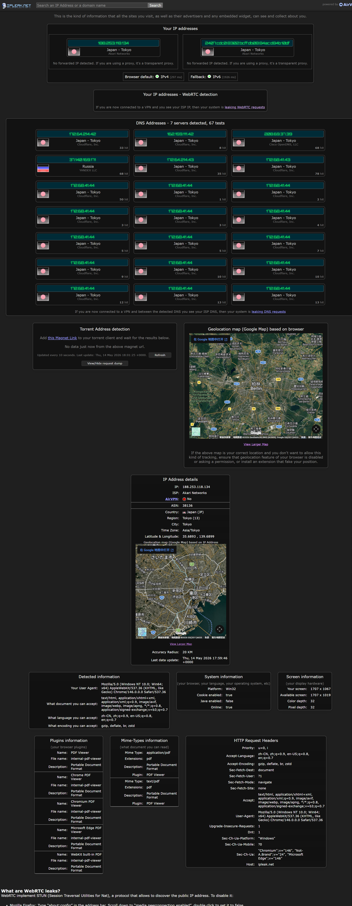
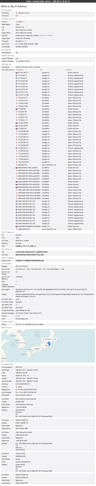

# Clash 全局扩展配置脚本

一个功能强大、高度可定制的 Clash 配置脚本，提供智能分流、DNS 防泄露、自动节点选择等功能。

## 📸 效果展示

### 代理策略组


### 代理节点详情


### 连接测试


### IP 检测效果
<div align="center">
  
  
</div>

*左：基础 IP 检测 | 右：BrowserLeaks 详细检测*

## ✨ 核心功能

### 1. 智能节点过滤
- **灵活的过滤规则**：支持按地区过滤节点（香港、台湾、日本、新加坡、美国、韩国等）
- **自动排除无效节点**：自动过滤掉官网、套餐、流量提示等非实际节点
- **简单配置**：只需取消注释对应行即可启用过滤

### 2. 自动节点选择（URL-Test）
- **智能测速**：自动选择延迟最低的节点
- **防抖动机制**：35ms 容差设计，避免频繁切换节点
- **分地区优选**：
  - 🇯🇵 日本自动
  - 🇹🇼 台湾自动
  - 🇺🇸 美国自动
- **可自定义参数**：
  - 测速间隔（默认 5 分钟）
  - 超时时间（默认 2 秒）
  - 测速 URL（默认 Google）
- **一键开关**：可通过配置完全禁用自动选择功能

### 3. DNS 防泄露
- **分流 DNS 解析**：
  - 国内域名使用国内 DNS（阿里、腾讯 DoH）
  - 国外域名使用国外 DNS（Cloudflare、Google、OpenDNS 等）
- **Fake-IP 模式**：提升解析速度，减少 DNS 泄露风险
- **智能缓存**：使用 ARC 算法优化 DNS 缓存

### 4. 精细化分流规则

#### 规则来源
- **Loyalsoldier**：基础规则集（reject、direct、proxy、gfw 等）
- **blackmatrix7**：专业服务规则（Google、Microsoft、流媒体等）
- **xiaolin-007**：特色规则（Bahamut 动画疯等）

#### 分流策略组
| 策略组 | 说明 | 默认策略 |
|--------|------|----------|
| 🌐 节点选择 | 主要代理出口 | 自动选择 |
| 🔍 谷歌服务 | Google 全家桶 | 节点选择 |
| 🎬 流媒体 | YouTube、Netflix、TikTok | 节点选择 |
| 💬 社交媒体 | Twitter、Telegram | 节点选择 |
| 🤖 AI | ChatGPT、OpenAI | 节点选择 |
| 🪟 微软服务 | Office、OneDrive、Azure | 直连 |
| 🍎 苹果服务 | iCloud、App Store | 节点选择 |
| 🎮 动画疯 | Bahamut（仅台湾节点） | 节点选择 |
| 📺 哔哩哔哩港澳台 | B站港澳台限定内容 | 直连 |
| 🎵 Spotify | Spotify 音乐服务 | 节点选择 |
| 🚫 广告过滤 | 广告拦截 | REJECT |
| 🎯 全局直连 | 国内网站直连 | DIRECT |
| 🐟 漏网之鱼 | 未匹配规则 | 节点选择 |

### 5. 自定义域名分流
支持在脚本中直接添加自定义域名到指定策略组：

```javascript
const customDomainSuffix = {
  "谷歌服务": [
    "scholar.google.com",
    "accounts.google.com"
  ],
  "流媒体": [
    "youtube.com",
    "netflix.com"
  ]
  // ... 更多自定义
};
```

### 6. 家宽 ISP 前置代理
- **链式代理**：支持通过家宽 ISP 作为前置节点
- **灵活切换**：可选择任意机场节点作为后端
- **UDP 支持**：所有节点统一开启 UDP 转发

## 🎯 主要优点

### 1. 开箱即用
- 无需复杂配置，导入即可使用
- 预设了常用服务的最佳分流策略
- 自动处理 DNS、规则集下载等细节

### 2. 高度可定制
- **模块化设计**：各功能独立，易于修改
- **注释详细**：每个配置项都有清晰说明
- **灵活扩展**：轻松添加自定义规则和策略组

### 3. 性能优化
- **智能缓存**：DNS 使用 ARC 算法缓存
- **懒加载**：策略组按需测速，减少资源消耗
- **防抖动**：避免频繁切换节点影响体验

### 4. 安全可靠
- **DNS 防泄露**：分流解析，避免 DNS 污染
- **规则持续更新**：使用 CDN 加速的规则集，每日自动更新
- **多重容错**：配置了多个 DNS 服务器，确保解析稳定

### 5. 覆盖全面
- **流媒体解锁**：支持 YouTube、Netflix、Bahamut、Spotify 等
- **AI 服务**：专门优化 ChatGPT 等 AI 服务访问
- **社交平台**：Twitter、Telegram 等一键直达
- **开发工具**：GitHub、Google 开发者服务等

## 📋 使用方法

### 1. 基础使用
1. 将脚本添加到 Clash Verge Rev 的配置预处理中
2. 导入你的机场订阅
3. 脚本会自动处理所有配置

### 2. 自定义节点过滤
在脚本顶部找到 `nodeFilterRules`，取消注释需要过滤的地区：

```javascript
const nodeFilterRules = [
  "港|hk|HK|Hong|HONG|九龙",  // ✅ 已启用：屏蔽香港
  // "台|tw|TW|Taiwan|TAIWAN",  // ❌ 未启用
];
```

### 3. 禁用自动选择
如果不需要自动选择节点功能：

```javascript
// const enableAutoSelect = true;  // 注释掉这行
const enableAutoSelect = false;     // 取消注释这行
```

### 4. 添加自定义域名
在 `customDomainSuffix` 对象中添加你的域名：

```javascript
const customDomainSuffix = {
  "谷歌服务": [
    "your-custom-domain.com"  // 添加你的域名
  ]
};
```

### 5. 配置家宽 ISP
找到脚本中的 ISP 配置部分，填入你的信息：

```javascript
config.proxies.push({
  name: "ISP",
  server: "your-isp-server.com",  // 修改为你的服务器
  port: 443,                       // 修改为你的端口
  username: "your-username",       // 修改为你的用户名
  password: "your-password",       // 修改为你的密码
  type: "socks5",
  "dialer-proxy": dialerGroupName,
  udp: true
});
```

## ⚙️ 高级配置

### 调整测速参数
```javascript
const autoSelectInterval = 300;    // 测速间隔（秒）
const autoSelectTimeout = 2000;    // 超时时间（毫秒）
const autoSelectTolerance = 35;    // 容差（毫秒）
```

### 修改 DNS 服务器
在 `domesticNameservers` 和 `foreignNameservers` 数组中添加或修改 DNS 服务器。

### 添加新的规则集
在 `ruleProviders` 对象中添加新的规则集：

```javascript
const ruleProviders = {
  // ... 现有规则
  "your-custom-rule": {
    ...ruleProviderCommon,
    behavior: "domain",
    url: "https://your-rule-url.com/rule.yaml",
    path: "./ruleset/custom/your-rule.yaml"
  }
};
```

## 🔧 兼容性

- ✅ Clash Verge Rev
- ✅ Clash Meta（mihomo）
- ✅ Clash Premium
- ❌ Clash 开源版（不支持 rule-providers）

## 📝 注意事项

1. **首次使用**：规则集需要下载，首次启动可能较慢
2. **ISP 配置**：如不使用家宽前置，可忽略 ISP 相关配置
3. **规则优先级**：自定义域名规则优先于规则集
4. **节点命名**：确保机场节点名称包含地区关键词（如"香港"、"日本"等）

## 🤝 贡献

欢迎提交 Issue 和 Pull Request 来改进这个配置脚本！

## ⚠️ 免责声明

### 重要提示

1. **仅供学习交流**
   - 本项目仅作为技术学习和研究使用
   - 用户应当遵守所在地区的法律法规
   - 不得将本项目用于任何违法违规用途

2. **使用风险**
   - 使用本配置脚本所产生的一切后果由使用者自行承担
   - 作者不对使用本脚本导致的任何问题负责
   - 包括但不限于：网络连接问题、数据泄露、法律风险等

3. **合规使用**
   - 请确保你有合法的网络访问权限
   - 建议仅在允许使用代理服务的地区和场景下使用
   - 企业用户请遵守公司网络使用政策

4. **第三方服务**
   - 本脚本使用的规则集来自第三方开源项目
   - DNS 服务器、测速 URL 等均为公共服务
   - 作者不对第三方服务的可用性和安全性负责

5. **隐私保护**
   - 使用前请确保你信任你的代理服务提供商
   - 建议不要在代理环境下进行敏感操作（如网银、支付等）
   - 注意保护个人隐私和账号安全

### 使用即代表同意

**下载、使用或分享本项目即表示你已阅读并同意以上免责声明。如不同意，请立即停止使用并删除相关文件。**

---

## 📄 许可

本项目采用 MIT 许可证，仅供学习交流使用。

## 🙏 致谢

**规则集来源：**
- [Loyalsoldier/clash-rules](https://github.com/Loyalsoldier/clash-rules)
- [blackmatrix7/ios_rule_script](https://github.com/blackmatrix7/ios_rule_script)
- [xiaolin-007/clash](https://github.com/xiaolin-007/clash)

**感谢以上开源项目的贡献者们！**
